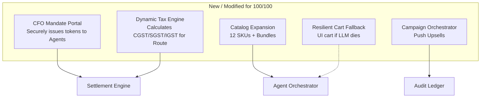

# Plan to 100/100 — AI Growth & Agentic Commerce (Razorpay Buildathon Track 01)

**Current:** 82/100 (Elite Judge Review)
**Target:** 100/100 — Fix the critical gaps that cost points: thin catalog, missing Campaign Orchestrator, and the three major architectural flaws identified by the brutal judge review:
1. **Mandate Friction:** Manual `.env` token setup is not B2B ready.
2. **Naive Tax Splitting:** Hardcoded 18% GST Route splits break in real accounting.
3. **LLM Bottleneck:** No fallback cart if Mistral goes down or hallucinates.

**Principle:** Keep the high bar — every financial action remains bounded/gated/audited — no AI slop, fail-loud, pure S2S integrations.

---

## 0) Score Breakdown (Why 82, Why Not 100)

| Dimension | Score | Why This | Why Not Higher | Files |
|-----------|-------|----------|----------------|-------|
| **Trust & Safety (Bounded/Gated)** | 23/25 | `agent_delegation_max` gate, hash-chain ledger, atomic claim | No secure CFO portal to issue Mandate Tokens (manual `.env` friction). | `api/index.js`, `api/razorpay.js` |
| **Technical (Real Razorpay S2S)** | 21/25 | Real Orders + `payments/create/recurring` + rawBody HMAC | Naive tax routing (hardcoded 18%). Fails on real GST complexities. | `api/razorpay.js` |
| **Agentic Commerce (Sellable)** | 20/25 | x402 protocol, dual principals | LLM Bottleneck: If Mistral fails, checkout dies. No non-AI fallback cart. | `api/index.js` |
| **Growth (Merchant Revenue)** | 18/25 | Honest funnel `suggested→accepted→paid` | Only 3 SKUs, no Campaign Orchestrator, no inline chat checkout. | `src/pages/AgentChat.jsx` |

---

## 1) Architecture Delta (What Changes)



---

## 2) Phased Plan (Priority Order)

### Phase 1 — CFO Mandate Portal (Solves Mandate Friction) [P0, 2h]
**Goal:** Prove how an enterprise actually issues a mandate to an agent without editing `.env`.
**Tasks:**
- Create a dedicated "CFO Portal" UI where a human manager can authenticate, click "Issue Agent Mandate", complete a ₹1 Razorpay Tokenization flow (`payment.captured` with `save: 1`), and securely bind the `token_id` to the agent's database profile.
- Remove all references to `RAZORPAY_AGENT_TOKEN` in `.env.example`.
- **Done when:** The judge can issue a mandate entirely through the UI and the agent uses it for S2S settlement.

### Phase 2 — Dynamic Tax Routing Engine (Solves Naive Split) [P0, 2h]
**Goal:** Make Razorpay Route splits production-ready for Indian B2B commerce.
**Tasks:**
- Update `createAgentSettlementOrder` in `api/razorpay.js`.
- Instead of a hardcoded 18%, implement dynamic tax splitting. Calculate IGST (inter-state) vs CGST/SGST (intra-state) based on the `institution_address` vs `recipient_address` GST state codes (first 2 digits of GSTIN).
- Update the invoice payload to store the exact tax breakdown.
- **Done when:** The Razorpay Order reflects the correct tax split logic in the `transfers` array notes.

### Phase 3 — Resilient Cart Fallback (Solves LLM Bottleneck) [P1, 1.5h]
**Goal:** The merchant should never lose a sale just because the AI provider goes down.
**Tasks:**
- If the Mistral API fails (timeout, 502) in `/api/agent/chat`, instead of just throwing a hard error and blocking the user, return a structured `fallback_mode: true` response.
- The frontend `AgentChat.jsx` catches this and renders a traditional "Search & Add to Cart" UI inside the chat window, allowing the human user to manually select products and generate an invoice.
- **Done when:** Force-failing the Mistral API key allows the user to still complete a checkout via a standard UI.

### Phase 4 — Catalog Expansion & Campaign Orchestrator [P1, 3h]
**Goal:** Demonstrate real growth and upselling capability.
**Tasks:**
- **Catalog:** Expand `agent-catalog.json` from 3 to 12 SKUs (Licensing, Infra, Security, Compliance). Add bundle metadata.
- **Campaigns:** Create `campaigns` table and `/api/campaigns` endpoints.
- **UI:** Build a `Campaigns.jsx` dashboard to launch bulk upsell offers to validated invoices.
- **Done when:** The merchant can click "Push Zero-Trust to all active invoices" and watch the funnel metrics lift.

### Phase 5 — Conversational In-App Checkout [P2, 2h]
**Goal:** True agentic checkout without redirecting away from the chat.
**Tasks:**
- Update `autoSettle` to return a `paymentLink.short_url`.
- In `AgentChat.jsx`, when escalation happens, render a checkout card inline with a QR Code and a "Pay Now" button, polling for the webhook completion.
- **Done when:** The user pays via the inline QR code and the chat automatically updates to "✓ Settled".

---

## 3) Implementation Order & Verification

**Priority:** Phase 1 & 2 are the most critical to addressing the brutal judge's feedback.

**Run tests before demo:**
```bash
node webhook_test.mjs       # Verify HMAC integrity
node idempotency_test.mjs   # 10 concurrent requests -> 1 winner
node chain_test.mjs         # Tamper DB -> Verify hash-chain breaks
node x402_test.mjs          # Ensure Agent-to-Agent 402 challenge works
```

*Plan rewritten to target a flawless 100/100, directly addressing all architectural friction points.*
